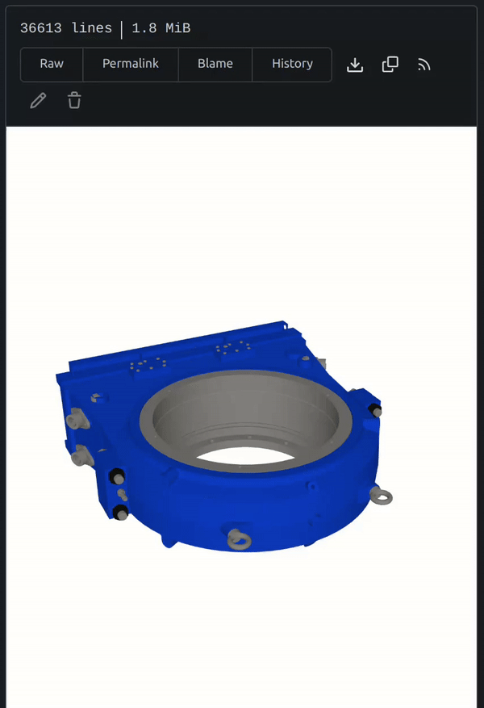

# Git3D

## Purpose

This is a fork of Gitea intended to be the easiest, fastest, and most painless way of managing & sharing open-source hardware projects. Collaborate with teams, organizations, or the general public. Clearly track changes to parts and components; share securely with anyone. Nearly any 3D file can be rendered directly in the browser, including large step files, SLDPARTs, NX .prt files, etc.

It can be used as a self-hosted Git service, or (COMING SOON) on our cloud service at [git3d.org](https://git3d.org)

As Gitea is written in Go, it works across **all** the platforms and
architectures that are supported by Go, including Linux, macOS, and
Windows on x86, amd64, ARM and PowerPC architectures.

## Quick Start

Clone this repo and simply run:

`docker-compose up -d`

then visit `localhost:3000` on your browser to see a local version in action. 

## Contributing

Expected workflow is: Fork -> Patch -> Push -> Pull Request
